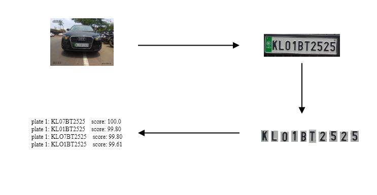

# CROP




Character Recognition Of Plates is a program desgined to detect and recognize character from images.
The project can be broken down to 3 independent modules
1. **License Plate Detection**  : This part is associated with detection of license plate from the image. The coordinates of license plates are used to crop the plate and pass it onto the next step.
2. **Character Detection**  : This step detect the character from the croped region. The coordinates of individual characters are then used to crop them. The sequence of characters are also sorted based on their x coordinate position to make them appear in the same order as in the license plate. This cropped characters are then passed on the final step for recognition.
3. **Character Recognition**  : This is the final step that returns a list of possible candidates. Since 8 can sometimes appear as B we need to return a fixed number of possibilities. All possible combinates are generated and are returned after sorting them on the basis of their score.

## Weights
- [Download weight](https://drive.google.com/drive/folders/1p3-IRQgjpCuM7ZQGUZp58MxH97rWdwby?usp=sharing)

## Datasets
- [License Plate Detection (custom anotation required)](https://www.kaggle.com/andrewmvd/car-plate-detection)
- [License Plate Character Detection](https://www.kaggle.com/thamizhsterio/indian-license-plates)
- Character Recognition [here](https://www.kaggle.com/kdnishanth/characterrecognitionfromnumberplate) & [here](https://www.kaggle.com/sahajap99/characters-dataset-for-license-plate-recognition)

## Enviornment
- Using Python 3.8.10
- ``` pip install -r requirements.txt``` for the rest of the packages

## CROP
- ### Arguments
  - source  : path of image (default is sample_car.png)
  - count   : the maximum number of possible plates to predict (default is 10)
- ### Execution
  - run ``` python crop.py ``` 

## Flask Crop App
- ### Arguments
  - source  : path of image (default is sample_car.png)
  - count   : the maximum number of possible plates to predict (default is 10)
- ### Execution
  - run ``` python flaskapp.py ``` 

## Contributors
- [XC4LIBUR](https://github.com/XC4LIBUR)
- [Royichan](https://github.com/Royichan)
- [deepak-delta](https://github.com/deepak-delta)